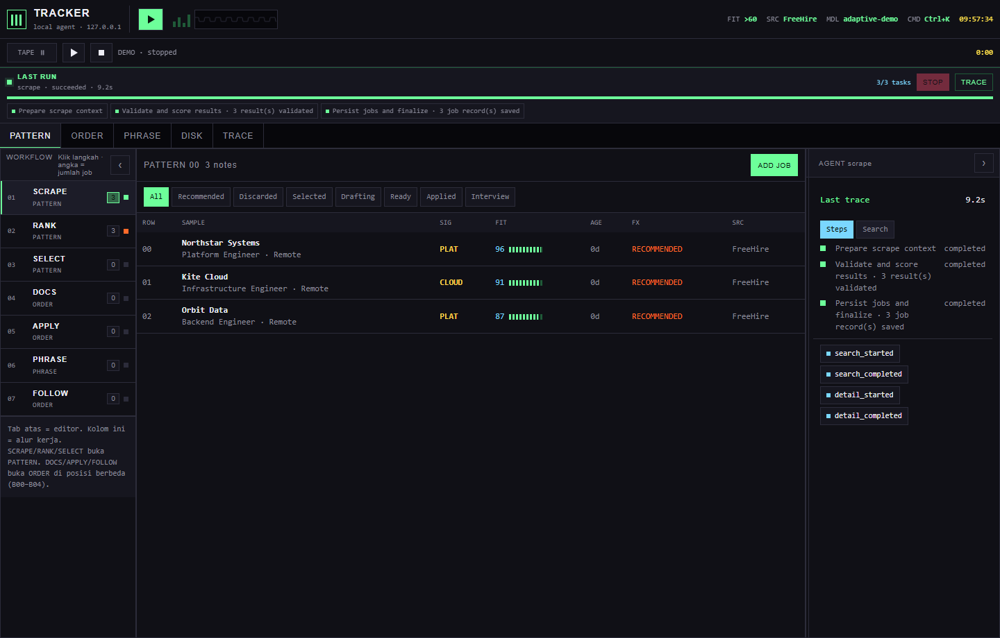
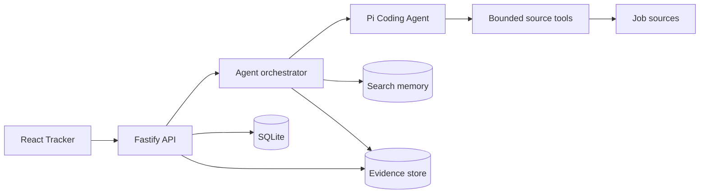

# Job Sequencer

Job Sequencer is a local-first job-search workbench for one person. It turns a reviewed profile and optional search preferences into a ranked shortlist, then keeps every next step manual.

The app runs on loopback. Pi handles bounded search and drafting workflows in-process. SQLite keeps the local record. Credentials stay in Pi's auth store or environment variables. The user approves documents and records applications.

<p align="center">
  
</p>

The screenshot and animated walkthrough use deterministic fixture data. They show the real Tracker UI without provider credentials.

<p align="center">
  
</p>

[Open the 24-second search-to-TRACE GIF](docs/assets/job-sequencer-walkthrough.gif)

## The product loop

1. Define a profile and optional search preferences in **DISK**.
2. Start a bounded search from **PATTERN**.
3. Let Pi refine the query when the first pass is weak.
4. Review ranked jobs and open their evidence in **SAMPLE**.
5. Select jobs yourself before document generation.
6. Approve drafts before you record **Applied**.
7. Practice in **PHRASE** and draft follow-up messages in **ORDER**.
8. Inspect every run in **TRACE**.

The workflow never submits an application, sends a message, or silently advances a job. Each stage ends at a visible approval gate.

## Architecture



The browser owns Tracker views and calls the API through `src/api.ts`. The API owns workflow state, run coordination, SQLite persistence, and approval boundaries. The orchestrator gives Pi typed search and detail tools instead of shell access. Search memory improves later queries without overriding current preferences.

## What the repository demonstrates

- A React and Vite workbench with PATTERN, SAMPLE, ORDER, PHRASE, DISK, and TRACE surfaces.
- Fastify routes backed by SQLite and explicit run IDs.
- Bounded Pi sessions with typed, source-specific tools.
- Deterministic fixtures for search adaptation, ranking, provenance checks, budget limits, and trace telemetry.
- Local-only operation with no cloud sync, automatic provider fallback, or hidden job submission.

The rest of this README is the operator guide. It keeps the complete install, authentication, runtime, verification, and safety details close to the commands they describe.

## Requirements

- Windows 10+
- Node.js 24.x and npm
- Bun (for the vendored job-source CLIs and their tests)
- Optional for PDF generation: `lualatex`, `xelatex`, `pdfinfo`, and `pdftotext`

Check the runtime:

```bash
node --version
npm --version
bun --version
```

## Install

From the repository root:

```bash
npm ci
```

The application uses Node/TypeScript. The vendored FreeHire, LinkedIn, and Japan board CLIs remain Bun-based; Relocate.me reuses the Japan-board CLI, while Y Combinator Remote and Indeed Indonesia use bounded public HTML adapters.

## Configure Qoder authentication

The dashboard does **not** accept or display API keys. The Qoder Agent SDK resolves credentials from the local `qodercli` login or from `QODER_PERSONAL_ACCESS_TOKEN`.

### Option A — qodercli login (recommended)

```bash
qodercli login
```

Complete the browser flow. Credentials stay in the qodercli auth store outside this repository. Do not copy auth files into the repository or commit them.

### Option B — environment variable

Set `QODER_PERSONAL_ACCESS_TOKEN` before starting the backend. Never put a real token in `data/`, `README.md`, or `data/settings.json`.

### Local runtime requirement

Sessions run through the local qodercli executable (process transport). Point the server at it:

```bash
set QODERCLI_PATH=C:\Users\you\.qoder\bin\qodercli\qodercli.exe
```

On POSIX use the `qodercli` path under `~/.qoder/bin/qodercli/`. The SDK's bundled worker runtime is intentionally not used.

### Check readiness

Start the backend and open the Tracker. DISK → MODEL lists the authenticated Qoder catalog once login succeeds. Pick a model and save; the account default ("Auto") bills Qoder credits, so an explicit selection is required.

Model selection uses the catalog `value` stored in Settings. BYOK custom models configured inside qodercli bill the provider account, not Qoder credits.

## Run the application

The frontend and API run as two local processes. Build the backend first:

```bash
npm run build
```

**Terminal 1 — API server:**

```bash
npm start
```

**Terminal 2 — Vite frontend:**

```bash
npm run dev
```

Open:

```text
http://127.0.0.1:5173
```

The primary UI is Tracker, a chiptune-inspired workspace using the same local API. Open it at:

```text
http://127.0.0.1:5173/
```

Tracker is the only frontend. It exposes PATTERN (jobs), SAMPLE (job detail), ORDER (applications), PHRASE (interview), DISK (profile, criteria, and settings), and TRACE (workflow runs). `/tracker.html` remains an explicit compatibility entry for the same Tracker app; no secondary frontend route is supported.

The API is available at `http://127.0.0.1:3000`; verify it with:

```bash
curl http://127.0.0.1:3000/health
```

Vite proxies `/api` and `/health` to the backend. After changing server-side TypeScript, run `npm run build` again and restart the long-lived API process; after frontend/source-control changes, restart the long-lived Vite process too. Do not kill user-managed ports blindly. The server is loopback-only; do not expose it to the LAN.

## First-run checklist

1. Open **DISK** and enable the job sources to search (FreeHire, LinkedIn, TokyoDev, Japan Dev, Relocate.me, Y Combinator Remote, or Indeed Indonesia). A scrape searches every checked source; each built-in source has an editable maximum age in days. FreeHire, LinkedIn, Relocate.me, Y Combinator Remote, and Indeed Indonesia default to `9999` (effectively no cutoff); TokyoDev and Japan Dev default to 45 days. Increasing a source above 45 days can return older postings and adds a warning asking you to verify that they are still active. Custom sources keep their bounded declarative HTTP(S) controls and do not require a posted-date field.
2. Select the Pi provider (`google`, `anthropic`, `openai`, or `openai-codex`).
3. Choose a model from the authenticated Model dropdown and save settings. The model field is non-secret configuration only.
4. Click **Test connection**. The credential remains in Pi auth storage/environment variables.
5. Open **DISK**, review and save the structured profile. Add search preferences when useful; they steer discovery but are not required.
6. Use **PATTERN** to scrape and review jobs. Select jobs manually before generating documents.

The canonical profile is `data/profile.json`. A legacy `data/profile.md` is preserved for review/import and is not overwritten automatically. Runtime data and generated applications are under gitignored `data/`.

## Verification commands

```bash
npm run typecheck
npm run check
npm run build
npm test
npm run eval
npm run test:vendor:freehire
npm run smoke
npm run smoke:latex
```

Optional live source check (network-dependent, capped at five jobs):

```bash
npm run live:scrape
```

Browser workflow check:

```bash
npm run smoke:browser
npm run smoke:browser:tracker
```

`smoke:browser` starts fixture API/frontend processes, opens the root Tracker, exercises PATTERN/ORDER/PHRASE/SAMPLE/DISK/TRACE, and checks zero console/page/request errors plus desktop/mobile overflow. `smoke:browser:tracker` remains an explicit alias for existing gate commands.

`smoke:latex` uses temporary files and fixed executable argument arrays. It exits non-zero when a compiler or PDF verifier is unavailable.

## Continuous integration

GitHub Actions runs `npm run check`, `npm test`, and `npm run eval` for pushes and pull requests. The workflow is [`.github/workflows/ci.yml`](.github/workflows/ci.yml).

## Workflow and safety boundaries

- Profile facts are serialized deterministically for each provider workflow.
- Pi sessions disable ambient skills, extensions, prompt templates, themes, context discovery, and unrestricted built-in tools where the workflow requires it.
- Scraping exposes only typed `searchJobs` and `fetchJobDetails` wrappers. Built-in sources use their vendored CLIs; custom sources use bounded HTTP(S) URL templates and data-only JSON paths or simple HTML selectors. No arbitrary commands or user code are accepted.
- Every workflow is manual: scraping does not automatically select jobs, generate documents, apply, start interview practice, or send follow-ups.
- Document generation stops at `Drafting`; explicit approval is required for `Ready`, and explicit manual recording is required for `Applied`.
- There is no user authentication, CORS, cloud sync, job submission, email sending, or automatic provider fallback.
- Keep credentials in Pi auth storage or environment variables. Never commit `auth.json`, `.env` files, API keys, tokens, or generated personal data.
